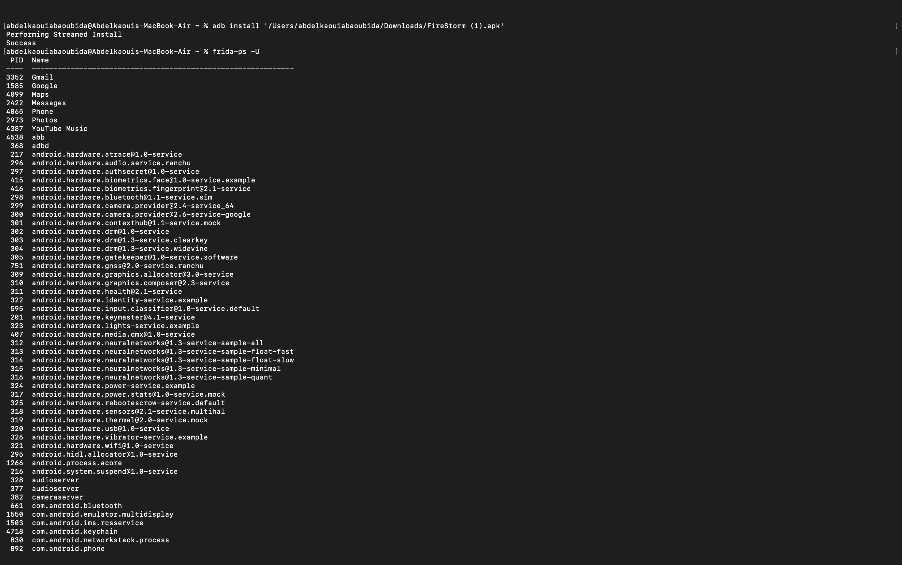
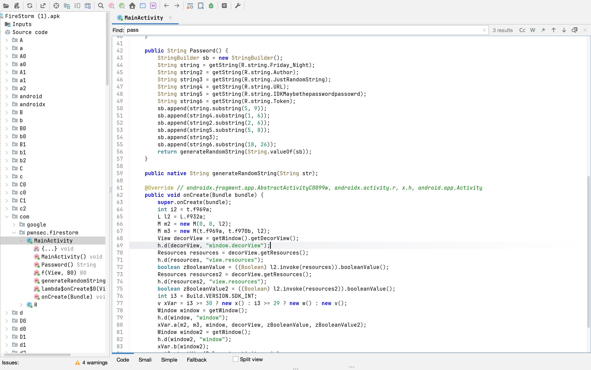
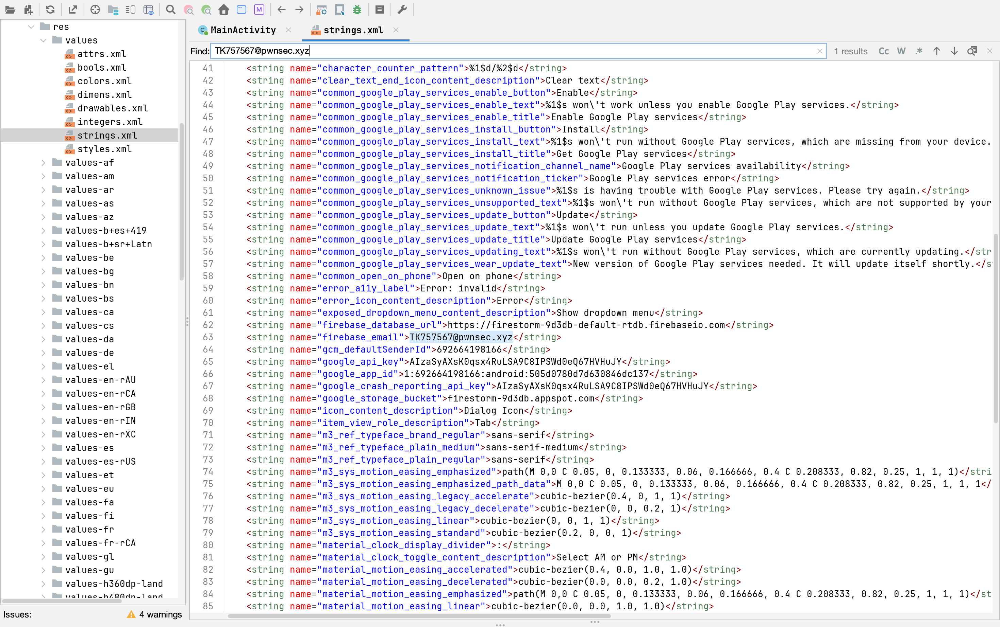

# 📱 Lab 18 – Analyse de sécurité d’une application mobile (FireStorm)

## 🛠️ Outils utilisés

* ADB (Android Debug Bridge)
* Frida
* JADX
* Émulateur Android

---

## ⚙️ Étape 1 : Installation de l’application et vérification des processus

L’application APK est installée sur l’émulateur Android à l’aide de la commande ADB.

```bash
adb install FireStorm.apk
```

Ensuite, Frida est utilisé pour afficher les processus actifs et vérifier que l’application est bien reconnue sur l’appareil.

```bash
frida-ps -U
```

<p align="center">
  
</p>


---

## 🧠 Étape 2 : Analyse du code avec JADX

L’application est décompilée avec JADX afin d’explorer sa structure interne et comprendre sa logique de fonctionnement.

Pendant l’analyse, une fonction située dans `MainActivity` est identifiée comme responsable de la génération du mot de passe.

<p align="center">
  
</p>


---

## 📂 Étape 3 : Analyse du fichier strings.xml

Le fichier `strings.xml` est examiné pour rechercher des informations sensibles présentes dans les ressources de l’application.

Les données découvertes incluent :

* Une adresse email Firebase
* Une clé API
* L’URL de la base de données

  <p align="center">
  
</p>


---

## ⚡ Étape 4 : Injection dynamique avec Frida

Un script Frida est exécuté afin d’intercepter la fonction de génération du mot de passe lors de l’exécution de l’application.

```bash
frida -U -f com.pwnsec.firestorm -l frida_firestorm.js
```

Cette approche permet d’observer le comportement interne de l’application en temps réel.
<p align="center">
  
</p>


---

## 🚨 Étape 5 : Récupération du flag

Après l’authentification réussie, l’accès à Firebase est obtenu.

Le flag final est ensuite récupéré à partir des données accessibles dans l’application.
<p align="center">
  
</p>


---

## ✅ Résultat final

✔ Mot de passe récupéré avec succès
✔ Connexion Firebase établie
✔ Flag extrait correctement

---

## 🧠 Conclusion

Ce laboratoire montre l’importance de renforcer la sécurité des applications mobiles.

Les principaux points à retenir sont :

* Éviter de stocker des données sensibles dans les ressources
* Limiter les risques liés au reverse engineering
* Protéger les clés API et les informations critiques
* Sécuriser les fonctions importantes contre l’instrumentation dynamique
